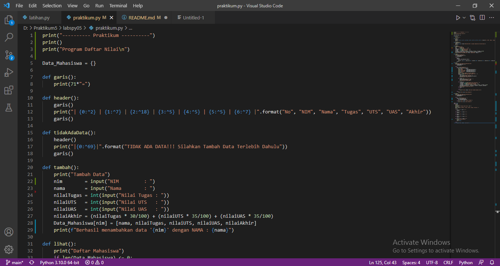
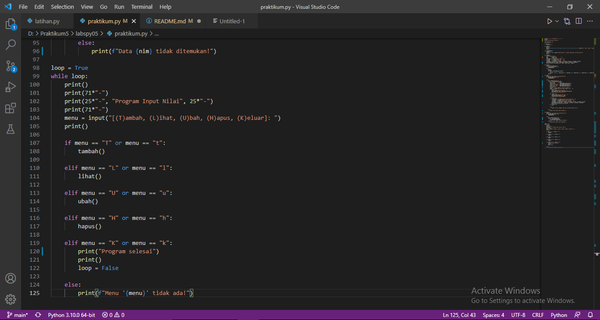
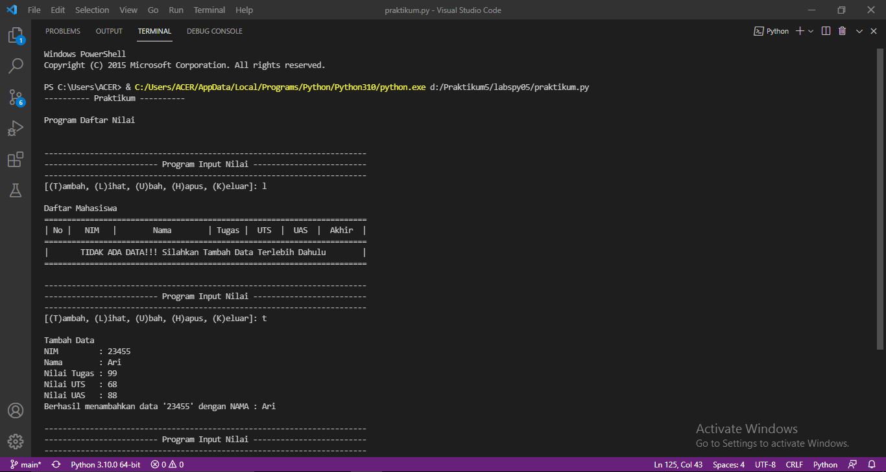

# labspy05
## Profil
- Nama : D.Wita Aeni
- Nim : 312110222
- Kelas : TI.21.A.1

## Latihan 
- Buat Dictionary daftar kontak
- Tampilkan kontak Ari
- Tambah kontak baru dengan nama Riko, nomor 627654544
- Ubah kontak Dina dengan nomor baru 6288999776
- Tampilkan semua nama
- Tampilkan semua nomor
- Tampilkan daftar nama dan nomornya
- Hapus kontak Dina

### PROGRAM


### OUTPUT


## Praktikum
### Program






### Penjelasan:
 
 1. Buat dictionary telebih dahulu untuk diisi dengan data
 ```python
Data_Mahasiswa = {} 
 ```
 
 2. Buat Function tambahan 
 ```python
def garis():
    print(71*"=")

def header():
    garis()
    print("| {0:^2} | {1:^7} | {2:^18} | {3:^5} | {4:^5} | {5:^5} | {6:^7} |".format("No", "NIM", "Nama", "Tugas", "UTS", "UAS", "Akhir"))
    garis()

def tidakAdaData(): 
    header()          
    print("|{0:^69}|".format("TIDAK ADA DATA!!! Silahkan Tambah Data Terlebih Dahulu"))
    garis()
 ```

 3. Membuat Function Program
#### Tambah()
- Masukan data
- Jika sudah dimasukan, maka data tersebut akan dimasukkan kedalam Dict `Data_Mahasiswa`
- Maka akan menampilkan "Berhasil menambahkan data 'nim' dengan NAMA : nama"
 ```python
 def tambah():
    print("Tambah Data")
    nim       = input("Nim        : ")
    nama        = input("NAMA         : ")
    nilaiTugas = int(input("Nilai Tugas : "))
    nilaiUTS   = int(input("Nilai UTS   : "))
    nilaiUAS   = int(input("Nilai UAS   : "))
    nilaiAkhir = (nilaiTugas * 30/100) + (nilaiUTS * 35/100) + (nilaiUAS * 35/100)
    Data_Mahasiswa[nim] = [nama, nilaiTugas, nilaiUTS, nilaiUAS, nilaiAkhir]
    print(f"Berhasil menambahkan data '{nim}' dengan NAMA : {nama}") 
 ```

 #### Lihat()
 1) Jika Dictionary `Data_Mahasiswa` tidak ada data maka memanggil function `tidakAdaData`
 ```python
 def lihat():
    print("Daftar Mahasiswa")
    if len(Data_Mahasiswa) <= 0:  
        tidakAdaData()
 ```
 
2) Program Lihat Data dijalankan 
- Untuk mengeluarkan data gunakan looping

```python
else:
    no = 0
    header()
    for data in Data_Mahasiswa.items():
            no += 1 
            print(f"| {no:>2} | {data[1][0]:<7} | {data[0]:<18} | {data[1][1]:>5} | {data[1][2]:>5} | {data[1][3]:>5} | {data[1][4]:>7.2f} |")               
    garis() 
```

#### Ubah()
1) Jika Dictionary `Data_Mahasiswa` tidak ada data maka memanggil function `tidakAdaData`
 ```python
 def ubah():
    print("Ubah Data Mahasiswa berdasarkan Nim")
    if len(Data_Mahasiswa) <= 0:  
        tidakAdaData()
 ```
 
2) Program Ubah Data dijalankan berdasarkan nim
- Masukan nim sebagai key lalu akan memunculkan isi data dari key tersebut
- Apabila salah memasukkan nim, maka akan mengeluarkan "data nim tidak ditemukan!"
- Selanjutnya diberi pilihan apa yang akan diubah, namun jika ingin membatalkan maka ketik 0
- Apabila salah memasukkan pilihan maka akan mengeluarkan "Pilihan input tidak ada! Silahkan masukan [1-3]"
 ```python
else:
   nim = input("Masukan nim : ")
   if nama in Data_Mahasiswa.keys():
      print(f"Nim        = {nim}")
      print(f"NAMA         = {Data_Mahasiswa[nim][0]}")
      print(f"Nilai Tugas = {Data_Mahasiswa[nim][1]}")
      print(f"Nilai UTS   = {Data_Mahasiswa[nim][2]}")
      print(f"Nilai UAS   = {Data_Mahasiswa[nim][3]}")
      print(25*"=")
      print("1. Nim\n2. NAMA\n3. Nilai\n0. Kembali")
      tanya = int(input("Apa yang ingin diubah? [1-3] : "))
      ...      
      elif tanya == 0:
          pass
          
      else:
          print(f"Pilihan {tanya} tidak ada! Silahkan masukan [1-3]")
   else:
      print(f"Data {nim} tidak ditemukan!") 
 ```
 
 ##### Mengubah Nim
 Masukan nim baru, maka nim akan berubah dan mengeluarkan "Berhasil merubah Nim!"
 ```python
 if tanya == 1:
    _nim = input("Masukan Nim Baru : ")
    Data_Mahasiswa[_nim] = Data_Mahasiswa.pop(nim)
    print("Berhasil merubah Nim! ")
 ```

##### Mengubah NAMA
Masukan NAMA baru, maka NAMA akan berubah dan mengeluarkan "Berhasil merubah NAMA!"
```python
elif tanya == 2:
    _nama = input("Masukan Nama Baru : ")
    Data_Mahasiswa[nim][0] = _nama
    print("Berhasil merubah NAMA!")
```

##### Mengubah Nilai
Masukan nilai baru, maka nilai akan berubah dan mengeluarkan "Berhasil merubah data nilai!"
```python
elif tanya == 3:
    _nilaiTugas = int(input("Masukan Nilai Tugas Baru : "))
    _nilaiUTS = int(input("Masukan Nilai UTS Baru : "))
    _nilaiUAS = int(input("Masukan Nilai UAS Baru : "))
    _nilaiAkhir = _nilaiTugas * 30/100 + _nilaiUTS * 35/100 + _nilaiUAS * 35/100
    Data_Mahasiswa[nim][1:4] = _nilaiTugas, _nilaiUTS, _nilaiUAS, _nilaiAkhir
    print("Berhasil merubah data nilai!")
```

#### Hapus Data()
1) Jika Dictionary `Data_Mahasiswa` tidak ada maka memanggil function `tidakAdaData`
```python
def hapus():
    print("Hapus Data Mahasiswa berdasarkan Nim")
    if len(Data_Mahasiswa) <= 0:  
        tidakAdaData()
```

2) Program Hapus Data Dijalankan
- Masukan nim sebagai key data yang akan dihapus
- Apabila salah memasukan nim, maka akan mengeluarkan "data nim tidak ditemukan!"
```python
else:
     nim = str(input("Masukan nim : "))
     if(nim in Data_Mahasiswa):
         del Data_Mahasiswa[nim]
         print(f"Data {nim} berhasil dihapus!")
     else:
         print(f"Data {nim} tidak ditemukan!") 
```

#### Menu
- Gunakan infinite loop sampai loopnya jadi false
- Jika salah memasukkan inputan maka akan muncul "Menu 'menu' tidak ada!"
- Apabila sudah benar maka function yang sudah dibuat akan dijalankan
```python
loop = True
while loop:
    print()
    print(71*"-")
    print(25*"-", "Program Input Nilai", 25*"-")
    print(71*"-")
    menu = input("[(T)ambah, (L)ihat, (U)bah, (H)apus, (K)eluar]: ")
    print()

    if menu == "T" or menu == "t":     
        tambah()

    elif menu == "L" or menu == "l":
        lihat()

    elif menu == "U" or menu == "u":
        ubah() 

    elif menu == "H" or menu == "h":
        hapus()

    elif menu == "K" or menu == "k":
        print("Program selesai")
        print()
        loop = False 

    else:
        print(f"Menu '{menu}' tidak ada!")
```

### Output



### Selesai
## Terima Kasih